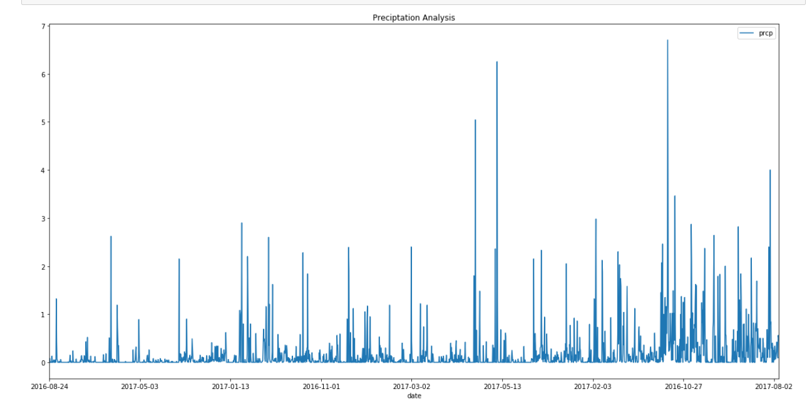
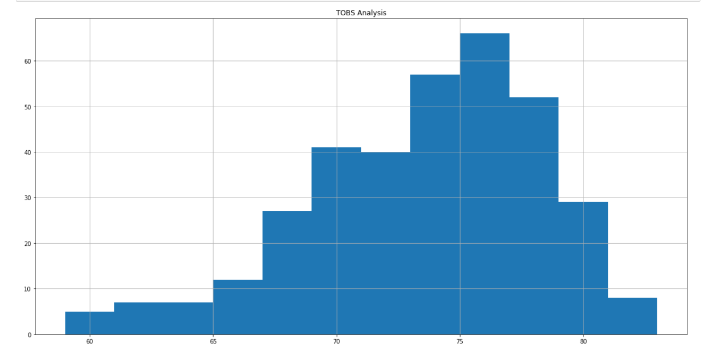
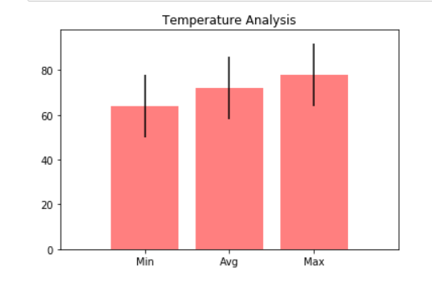

# Climate-Analysis-API
## Objective:
Conduct a climate analysis on Honolulu, Hawaii and share my analytical skills with the community by providing a climate analysis api !

## Step 1 - Data Engineering
The climate data for Hawaii is provided through two CSV files. I used Python and Pandas to inspect the content of these files and clean the data.
* Created a Jupyter Notebook file called `data_engineering.ipynb` and used this to complete all of the Data Engineering tasks.

* Used Pandas to read in the measurement and station CSV files as DataFrames.

* Inspected the data for NaNs and missing values

* Save the cleaned CSV files with the prefix `clean_`.

## Step 2 - Database Engineering
Used SQLAlchemy to model the table schemas and created a sqlite database for the tables. one table for measurements and one for stationsare created.

* Created a Jupyter Notebook called `database_engineering.ipynb` and used this to complete all of the Database Engineering work.

* Used Pandas to read the cleaned measurements and stations CSV data.

* Used the `engine` and connection string to create a database called `hawaii.sqlite`.

* Used `declarative_base` and create ORM classes for each table.

  * A class for `Measurement` and a class for `Station`are created.

  * Primary keys for the tables are defined.

* Once the ORM classes are defined, the tables are created in the database using `create_all`.

## Step 3 - Climate Analysis and Exploration

Used Python and SQLAlchemy to do basic climate analysis and data exploration on the new weather station tables. All of the following analysis are completed using SQLAlchemy ORM queries, Pandas, and Matplotlib.

* Created a Jupyter Notebook file called `climate_analysis.ipynb` and used it to complete all of the climate analysis and data exporation.

* Chose a start date and end date for my trip. Made sure that my vacation range is approximately 3-15 days total.

* Used SQLAlchemy `create_engine` to connect to my sqlite database.

* Used SQLAlchemy `automap_base()` to reflect my tables into classes and save a reference to those classes called `Station` and `Measurement`.

## Precipitation Analysis

* Designed a query to retrieve the last 12 months of precipitation data.

* Selected only the `date` and `prcp` values.

* Loaded the query results into a Pandas DataFrame and set the index to the date column.

* Plotted the results using the DataFrame `plot` method.

* Used Pandas to print the summary statistics for the precipitation data.

### Station Analysis

* Designed a query to calculate the total number of stations.

* Designed a query to find the most active stations.

  * List the stations and observation counts in descending order

  * Which station has the highest number of observations?

* Designed a query to retrieve the last 12 months of temperature observation data (tobs).

  * Filtered by the station with the highest number of observations.

  * Plotted the results as a histogram with `bins=12`.
  
  ### Temperature Analysis
  
  

* Wrote a function called `calc_temps` that will accept a start date and end date in the format `%Y-%m-%d` and return the minimum, average, and maximum temperatures for that range of dates.

* Used the `calc_temps` function to calculate the min, avg, and max temperatures for the trip using the matching dates from the previous year (i.e. use "2017-01-01" if my trip start date was "2018-01-01")

* Plotted the min, avg, and max temperature from my previous query as a bar chart.

  * Used the average temperature as the bar height.

  * Used the peak-to-peak (tmax-tmin) value as the y error bar (yerr).

## Step 4 - Climate App

Now that I have completed the initial analysis, design a Flask api based on the queries that are just developed.

* Used FLASK to create the routes.

### Routes

* `/api/v1.0/precipitation`

  * Query for the dates and temperature observations from the last year.

  * Convert the query results to a Dictionary using `date` as the key and `tobs` as the value.

  * Return the json representation of the dictionary.

* `/api/v1.0/stations`

  * Return a json list of stations from the dataset.

* `/api/v1.0/tobs`

  * Return a json list of Temperature Observations (tobs) for the previous year

* `/api/v1.0/<start>` and `/api/v1.0/<start>/<end>`

  * Return a json list of the minimum temperature, the average temperature, and the max temperature for a given start or start-end range.

  * When given the start only, calculated `TMIN`, `TAVG`, and `TMAX` for all dates greater than and equal to the start date.

  * When given the start and the end date, calculated the `TMIN`, `TAVG`, and `TMAX` for dates between the start and end date inclusive.
  
* The station and measurement tables were joined for some of the analysis queries.

* Used Flask `jsonify` to convert the api data into a valid json response object.

